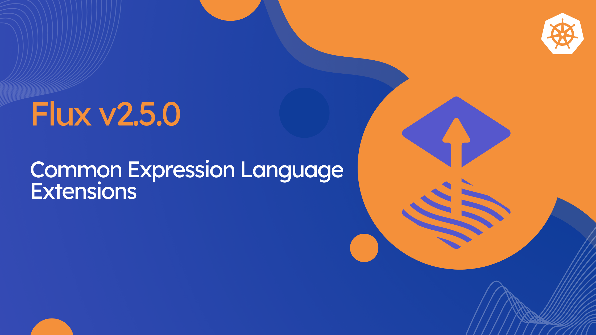

Support for GitHub App authentication was introduced in Flux 2.5.0 for the `GitRepository` API.
This is a significant improvement in terms of authentication security for GitHub repositories.

All the GitHub repository authentication methods prior to Flux 2.5.0 were based on using a
secret that is tied to a GitHub user, be it an SSH deploy key or a personal access token.
This is a risk for organizations since the secret is not tied to the organization itself.
If the user leaves the organization, the secret is lost and Flux will no longer be able to
access the repository. An alternative employed by some organizations is to create a bot
user and give it access to the repositories, but this is also not ideal since a user
affects the billing and limits of the organization, plus adds the complexity of managing
this user. The login credentials and MFA code have to be stored somewhere, like an external
secret management system.

GitHub Apps not only reduce the attack surface for stealing credentials but also solves
the organization's problem of dependency on a user. The GitHub App can be created on the
organization account and given access to the repositories it needs.

The `flux bootstrap` CLI command was designed a long time prior to the introduction of
GitHub Apps and therefore does not support it out of the box. ControlPlane's Flux Operator,
on the other hand, supports bootstrap with GitHub App authentication and simplifies the
process, vendoring the Flux installation manifests is no longer a requirement. It can also
automate the upgrade of Flux when you specify a semver range like. Check out the
alternatives below.

# Using the `helm`, `flux` and `kubectl` CLIs

First, install the Flux Operator using the Helm chart:

```shell
helm install flux-operator oci://ghcr.io/controlplaneio-fluxcd/charts/flux-operator \
  --namespace flux-system \
  --create-namespace
```

Next, create a GitHub App secret using the `flux` CLI:

```shell
flux create secret githubapp flux-system \
  --app-id=1 \
  --app-installation-id=2 \
  --app-private-key=./path/to/private-key-file.pem
```

Finally, bootstrap the cluster applying a `FluxInstance` custom resource:

```yaml
kubectl apply -f - <<EOF
apiVersion: fluxcd.controlplane.io/v1
kind: FluxInstance
metadata:
  name: flux
  namespace: flux-system
spec:
  distribution:
    version: "2.x"
    registry: "ghcr.io/fluxcd"
  components:
    - source-controller
    - kustomize-controller
    - helm-controller
    - notification-controller
    - image-reflector-controller
    - image-automation-controller
  sync:
    kind: GitRepository
    provider: github
    url: "https://github.com/my-org/my-fleet.git"
    ref: "refs/heads/main"
    path: "clusters/my-cluster"
    pullSecret: "flux-system"
EOF
```

# Using Terraform

Alternatively, you can use Terraform to install the Flux Operator and
a `FluxInstance` like in [this example](https://github.com/controlplaneio-fluxcd/flux-operator/blob/main/config/terraform/README.md).

The command for applying this Terraform example with a GitHub App would be the following:

```shell
export GITHUB_APP_PEM=`cat path/to/app.private-key.pem`

terraform apply \
  -var flux_version="2.x" \
  -var flux_registry="ghcr.io/fluxcd" \
  -var github_app_id="1" \
  -var github_app_installation_id="2" \
  -var github_app_pem="$GITHUB_APP_PEM" \
  -var git_url="https://github.com/org/repo.git" \
  -var git_ref="refs/heads/main" \
  -var git_path="clusters/production"
```
